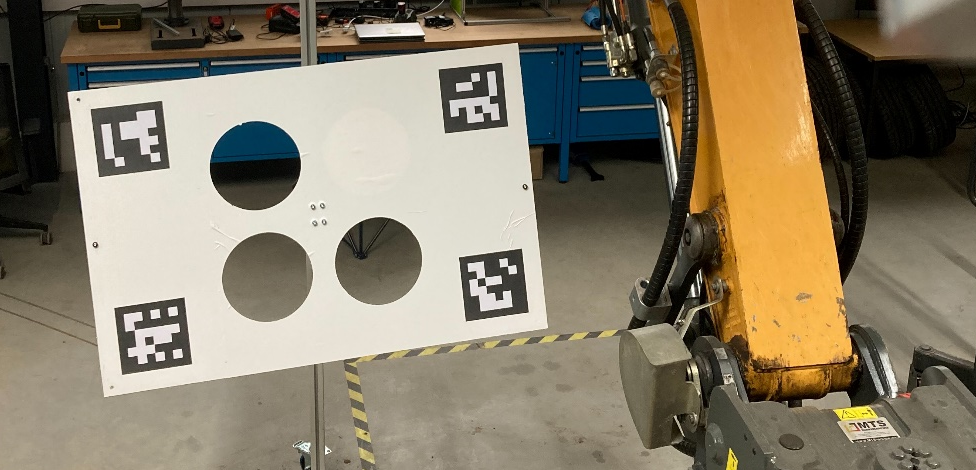

# Calibration Target

For extrinsic Multi-Sensor Calibration the toolbox was developed to use an asymmetric calibration target as depicted below.
The asymmetry allows to detect a full 6-DOF pose of the target within the sensor data, reducing possible ambiguities in the correspondence search and making the calibration process more robust.


*Figure 1: Picture of the asymmetric calibration target used for extrinsic calibration.*

The default calibration target used by 'multisensor_calibration' has the following properties:

- **Width:** 1.2m
- **Height:** 0.8m

- Three **Circular Cutouts**
    - with a **Radius:** 0.12m
    - **located** plus-minus 0.15m in X-Y direction around the center.

- Four **ArUco Markers** from ```DICT_6X6_250```
    - with the **IDs:** 1, 2, 3, 4 (arranged clockwise, starting from top-left)
    - with an **Edge Length:** 0.18m
    - **located** plus-minus 0.05m in X-Y direction from the respective corner of the board

## Using a Custom Calibration Target

The Multi-Sensor Calibration the toolbox, however, allows to adjust the parameters of the calibration target by editing them within a yaml file: `<repository>/mutlisensor_calibration/cfg/TargetWithCirclesAndAruco.yaml`

```yaml
%YAML:1.0
board_width: 1.2        # width of board in meters
board_height: 0.8       # height of board in meters
marker_size: 0.18       # side length of aruco markers in meters
marker_ids:             # ids of marker used as a single column matrix
    rows: 4
    cols: 1
    dt: i
    data: [1, 2, 3, 4]  # marker order goes clockwise, starting from top left of board
marker_positions:       # x,y marker positions (top-left) on board relative to center, stored row-by-row in meters. x: rightwards, y: upwards
    rows: 4
    cols: 2
    dt: f
    data: [-0.55, 0.35,
           0.37, 0.35,
           0.37, -0.17,
           -0.55, -0.17]
cutouts:                # Cutouts (id + parameters) stored as a single row matrix. x: rightwards, y: upwards
    rows: 1
    cols: 12
    dt: f
    data: [1, -0.15, 0.15, 0.12,    # Circular cutout: (id: 1, parameters: {X,Y,Radius})
           1, 0.15, -0.15, 0.12,    
           1, -0.15, -0.15, 0.12]   
min_marker_detection: 2 # minimum number of markers that need to be detected in the camera image
cad_model_mesh: "calibration_target_3holes_cad_mesh.ply" # relative file path to CAD model of the calibration target as mesh
cad_model_cloud: "calibration_target_3holes_cad_cloud.ply" # relative file path to CAD model of the calibration target as cloud
```

*The CAD model mesh/cloud is used for the optimization of the detected target pose by aligning the model data to the segmented point cloud by means of GICP.*