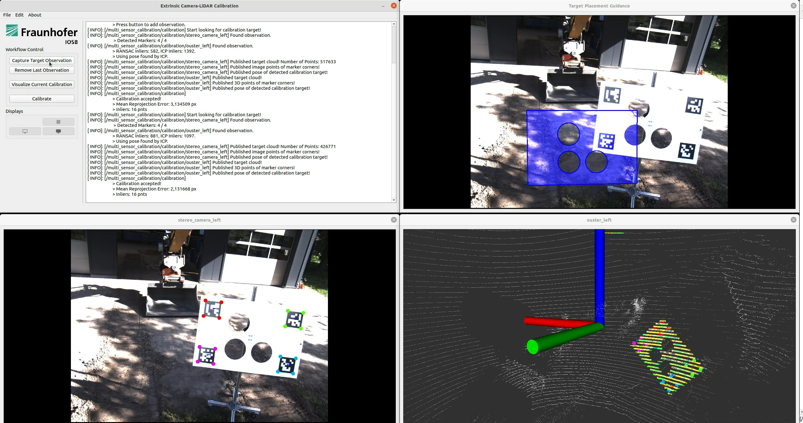

# Multi-Sensor Calibration Toolbox


*With a graphical user interface the Multi-Sensor Calibration Toolbox guides the user through the calibration of a camera-LiDAR sensor setup.*

## About

`multisensor_calibration` is an actively maintained universal calibration toolbox for assisted, target-based multi-sensor calibration with ROS 1 and ROS 2 support. 
It provides a variety of methods and applications to calibrate complex multi-sensor systems, e.g.

- <b>Extrinsic Camera-LiDAR Calibration</b>,
- <b>Extrinsic Camera-Reference Calibration</b>,
- <b>Extrinsic LiDAR-LiDAR Calibration</b>,
- <b>Extrinsic LiDAR-Reference Calibration</b>, and
- <b>Extrinsic LiDAR-Vehicle Calibration</b> (prototype).

The software is licensed under the new [BSD 3-Clause license](license.md). If you use this project for your research, please cite:

```text
@inproceedings{
    ruf2025_multisensor_calibration,
    title={Multi-Sensor Calibration Toolbox for Large-Scale Offroad Robotics},
    author={Boitumelo Ruf and Miguel Granero and Raphael Hagmanns and Janko Petereit},
    conference={German Robotics Conference (GRC) 2025},
    year={2025},
} 
```

The latest source code is available on [GitHub](https://github.com/FraunhoferIOSB/multisensor_calibration).
Furthermore, the `multisensor_calibration` will also be released as an official package for ROS 2 and be installable with apt.
Since ROS 1 is soon end-of-life, there will be no official release for ROS 1.
However, there is a version of the source code available for ROS 1 under the branch [noetic](https://github.com/FraunhoferIOSB/multisensor_calibration/tree/noetic).

## Getting Started

1. See our [Installation](installation.md) page on how to install it with apt-get as ROS 2 package or how to build from source.
2. Look at the [Tutorial](tutorial.md) page on how to use use it to calibrate your sensor setup.

## Support

Please, use [GitHub Discussions](https://github.com/FraunhoferIOSB/multisensor_calibration/discussions) for questions and the [GitHub issue tracker](https://github.com/FraunhoferIOSB/multisensor_calibration/issues) for bug reports, feature requests/additions, etc.

Or look at the [troubleshooting](troubleshooting.md) page.

To get information on how to contribute, please look at our [contribution guide](https://github.com/FraunhoferIOSB/multisensor_calibration/blob/main/CONTRIBUTING.md).

## Acknowledgements

This software was developed as part of the projects [AKIT-PRO](https://a-kit.de) (grant no. 13N15673) and [ROBDEKON – Robotic Systems for Decontamination in Hazardous Environments](https://robdekon.de/) (grant nos. 13N14674 and 13N16538), funded by the Federal Ministry of Education and Research (BMBF) under the German Federal Government’s Research for Civil Security program.

The Multi-Sensor Calibration Toolbox was originally developed by [Boitumelo Ruf](https://github.com/boitumeloruf). 
It is currently mainly maintained by [Miguel Granero](https://github.com/migranram) supported by other members of the [Autonomous Robotic Systems](https://github.com/orgs/FraunhoferIOSB/teams/mrd) group from the Fraunhofer IOSB
