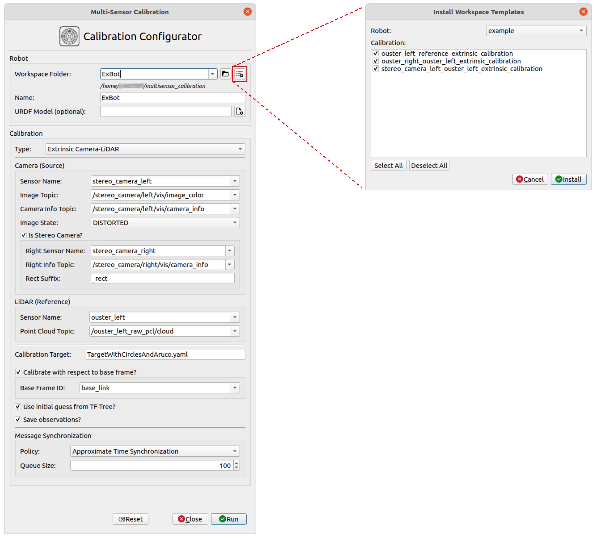
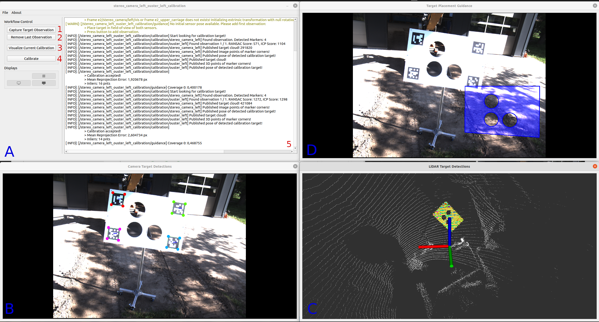
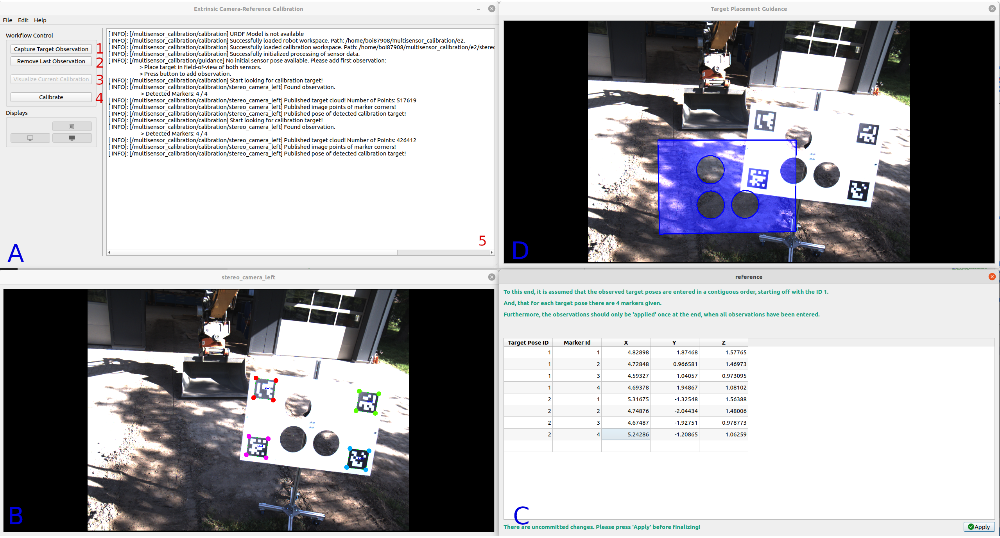

# Tutorial

To have a unified starting point 'multisensor_calibration' offers a Calibration Configurator which allows to choose and parameterize the desired calibration.
This can be started without any launch parameters, just by calling 

```
ros2 run multisensor_calibration multi_sensor_calibration
```

The [Calibration Configurator](#calibration-configurator) provides a graphical user interface to configure and run one of the following sensor calibrations:

- [Extrinsic Camera-LiDAR Calibration](#extrinsic-camera-lidar-calibration)
- [Extrinsic LiDAR-LiDAR Calibration](#extrinsic-lidar-lidar-calibration)
- [Extrinsic Camera-Reference Calibration](#extrinsic-camera-reference-calibration)
- [Extrinsic LiDAR-Reference Calibration](#extrinsic-lidar-reference-calibration)

Alternatively, the individual calibrations could also be started as standalone nodes without the calibrator. 
In this, the user has to manually specify the appropriate launch parameters, which is why the use of the Calibration Configurator is recommended. 
For more information on that please look into the [Nodes](nodes_and_nodelets.md#nodes) section.

The calibration configurations, together with the results are stored and organized within [workspaces](workspaces.md). 
In this, for each sensor calibration an individual workspace folder is generated and all calibration workspaces belonging to a single robot are, in turn, grouped into a robot workspace.

<hr>

## Calibration Configurator

The Calibration Configurator provides a graphical user interface to configure and run one of the different sensor calibrations.


*Figure 1: Graphical user interface of the Calibration Configurator.*

As further discussed on the [workspace page](workspaces.md), the configurations and results of the individual sensor calibrations are organized within a workspace structure consisting of robot and calibration workspaces. 
Thus, in addition to the individual calibration configurations, a few robot settings also need to be set. 

The Calibration Configurator also allows to install workspace templates. This is especially helpful when running the calibration for the first time.
For more information on how to add new templates please refer to corresponding [section](workspaces.md#workspace-templates)

### Robot Options

- **Workspace Folder:** Select workspace folder of the robot workspace you wish to open. If a folder is entered that does not yet exist, a new workspace will be generated.

All the different robot workspace folders are located in the root directory (*Default: $HOME/multisensor_calibration*), which is listed below the corresponding combo box. 
To select a different root directory, press the push button next to the combo box of the workspace folder. 
To install workspace templates into the root directory, press the appropriate push button on the right.
This will open another dialog, in which the robot and corresponding sensor calibrations can be selected.

- **Robot Name:** Name of the robot.
- **URDF Model:** Optional URDF model of the robot.

### Calibration Options

When a robot is selected, the calibration type, which is to be executed can be selected by the appropriate combo box:

- **Calibration Type:** Calibration type you wish to execute.
Depending on the selected calibration type, different calibration options will be made available.
At the start, the combo boxes and text edits will be populated with the available data, i.e. topic names or frame IDs.

*If a chosen configuration of 'Calibration Type', 'Source Sensor Name', and 'Reference Sensor Name' has already been calibrated and a corresponding settings file is found in the calibration workspace, the rest of the options will be set according to the data found in the settings file.*

In the following the available options for the different calibration types are presented.

**Extrinsic Camera-LiDAR Calibration**

- **Camera Sensor Name:** Name of the source camera sensor.
- **Image Topic:** Topic name on which the camera images are published.
- **Camera Info Topic:** Topic name on which the camera images are published.
- **Image State:** Select the state of the image data.
*This is need in order to choose the correct data from the camera info messages during calibration.*
    - DISTORTED: The image directly coming from the sensor, i.e. containing lense distortion. 
    - UNDISTORTED: The image has been made free of lense distortion.  
    - STEREO_RECTIFIED: The image comes from a stereo camera has been rectified so that the images of both cameras align horizontally.
- **Is Stereo Camera?:** Set to true, if camera is to be calibrated as stereo camera. If activated, 'Right Sensor Name' and 'Right Info Topic' also need to be set.
- **Right Sensor Name:** Name of the right camera sensor when the camera is to be calibrated as a stereo camera system. 
- **Right Info Topic:** Topic name of the camera info corresponding to the right camera. This is needed when the camera is to be calibrated as a stereo camera system.
- **Rect Suffix:** Suffix of the of the right sensor name as well as the frame id for the rectified images. If the 'Image State' of the input images is DISTORTED or UNDISTORTED, this is added to the rectified frame id. If the 'Image State' is STEREO_RECTIFIED this is removed from the frame ID.

- **LiDAR Sensor Name:** Name of the reference LiDAR sensor.
- **Point Cloud Topic:** Topic name on which the point clouds are published.

- **Calibration Target:** Configuration file of the calibration target.
*Currently not editable.*

- **Calibrate with respect to base frame?** Calibrate the pose of the source sensor with respect to a base frame.
- **Base Frame ID:** Frame ID of the base frame with respect to which the pose is to be calibrated.

- **Use initial guess from TF-Tree?** Use the data provided by the TF-Tree to extract an initial guess for the calibration.
- **Save Observations?** Save the observations which have been used for the calibration into the calibration workspace.

- **Message Synchronization Policy:** Select which type of time synchronization is to be used to synchronize the sensor messages.
- **Synchronization Queue Size:** Queue size used for the time synchronization.

**Extrinsic LiDAR-LiDAR Calibration**

- **Source LiDAR Sensor Name:** Name of the source LiDAR sensor.
- **Source Point Cloud Topic:** Topic name on which the source point clouds are published.

- **Reference LiDAR Sensor Name:** Name of the reference LiDAR sensor.
- **Reference Point Cloud Topic:** Topic name on which the reference point clouds are published.

- **Calibration Target:** Configuration file of the calibration target.
*Currently not editable.*

- **Additionally align ground planes?** Set to true, to additionally align the ground planes in the sensor data. 
If true, this also requires the frame ID of an upright frame in order to find the orientation of the ground plane.
- **Upright Frame ID:** - ID of frame which has an upwards pointing z-axis. Used to detect ground plane in sensor data.

- **Calibrate with respect to base frame?** Calibrate the pose of the source sensor with respect to a base frame.
- **Base Frame ID:** Frame ID of the base frame with respect to which the pose is to be calibrated.

- **Use initial guess from TF-Tree?** Use the data provided by the TF-Tree to extract an initial guess for the calibration.
- **Save Observations?** Save the observations which have been used for the calibration into the calibration workspace.

- **Message Synchronization Policy:** Select which type of time synchronization is to be used to synchronize the sensor messages.
- **Synchronization Queue Size:** Queue size used for the time synchronization.

**Extrinsic Camera-Reference Calibration**

- **Camera Sensor Name:** Name of the source camera sensor.
- **Image Topic:** Topic name on which the camera images are published.
- **Camera Info Topic:** Topic name on which the camera images are published.
- **Image State:** Select the state of the image data.
*This is need in order to choose the correct data from the camera info messages during calibration.*
    - DISTORTED: The image directly coming from the sensor, i.e. containing lense distortion. 
    - UNDISTORTED: The image has been made free of lense distortion.  
    - STEREO_RECTIFIED: The image comes from a stereo camera has been rectified so that the images of both cameras align horizontally.
- **Is Stereo Camera?:** Set to true, if camera is to be calibrated as stereo camera. If activated, 'Right Sensor Name' and 'Right Info Topic' also need to be set.
- **Right Sensor Name:** Name of the right camera sensor when the camera is to be calibrated as a stereo camera system. 
- **Right Info Topic:** Topic name of the camera info corresponding to the right camera. This is needed when the camera is to be calibrated as a stereo camera system.
- **Rect Suffix:** Suffix of the of the right sensor name as well as the frame id for the rectified images. If the 'Image State' of the input images is DISTORTED or UNDISTORTED, this is added to the rectified frame id. If the 'Image State' is STEREO_RECTIFIED this is removed from the frame ID.

- **Reference Name:** Name of the reference.
- **Reference Frame ID:** Frame ID in which the reference data is provided.

- **Calibration Target:** Configuration file of the calibration target.
*Currently not editable.*

- **Calibrate with respect to base frame?** Calibrate the pose of the source sensor with respect to a base frame.
- **Base Frame ID:** Frame ID of the base frame with respect to which the pose is to be calibrated.

- **Use initial guess from TF-Tree?** Use the data provided by the TF-Tree to extract an initial guess for the calibration.
- **Save Observations?** Save the observations which have been used for the calibration into the calibration workspace.

**Extrinsic LiDAR-Reference Calibration**

- **Source LiDAR Sensor Name:** Name of the source LiDAR sensor.
- **Source Point Cloud Topic:** Topic name on which the source point clouds are published.

- **Reference Name:** Name of the reference.
- **Reference Frame ID:** Frame ID in which the reference data is provided.

- **Calibration Target:** Configuration file of the calibration target.
*Currently not editable.*

- **Calibrate with respect to base frame?** Calibrate the pose of the source sensor with respect to a base frame.
- **Base Frame ID:** Frame ID of the base frame with respect to which the pose is to be calibrated.

- **Use initial guess from TF-Tree?** Use the data provided by the TF-Tree to extract an initial guess for the calibration.
- **Save Observations?** Save the observations which have been used for the calibration into the calibration workspace.

<hr>

## Extrinsic Camera-LiDAR Calibration

The camera-LiDAR calibration is comprised of estimating a relative transformation of a given camera sensor with respect to a given LiDAR sensor.
The calibration is performed by solving the <i>Perspective-n-Point (P-n-P)</i> problem with the help of a series of 2D-3D-point-correspondences.


*Figure 1: Graphical user interface of the extrinsic camera-LiDAR calibration after the calibration target has been detected in the camera image and the LiDAR point cloud. In this, the camera image is annotated with the corners of the ArUco markers and the detected target structure is highlighted with yellow in the LiDAR point cloud.*

After starting up, the GUI, as depicted in [Figure 1](), will appear. It is made up of,
- a 'Control Window' (A), 
- a view on the target detections in the camera images (B),
- a view of the target detections in the LiDAR cloud (C), as well as 
- a view on a dialog that is supposed to guide the user in the placement of the calibration target (D) *(currently in development)*.

The calibration node continuously detects and tracks the ArUco marker inside the camera image and selects potential candidates of the calibration target inside the LiDAR cloud.
In this, the markers are framed and for the points of the target candidates in the point cloud are displayed with the corresponding intensity value.

To perform an extrinsic calibration, follow the steps below:

1. Start off by **placing the calibration target** in the center of the camera image and parallel to the image plane. Place the target at such a distance to the camera, that its width will fill out approximately half of the image width.
2. Make sure that the markers are detected in the camera image and the target structure is highlighted in the LiDAR cloud.
3. If at least 3 markers are detected and the target structure is highlighted, **click on Button 1 'Capture Target Observation'** to trigger full detection and precise estimation of the calibration target in the sensor data and to add the detection to the observation list.
When finished the corresponding sensor data will be annotated with the detections as seen in [Figure 1](). In this, 
    - the camera image will be annotated with the corners of the detected ArUco markers (color coded with rainbow color map according to the ID of the marker).
    - the points of the LiDAR cloud that correspond to the detected calibration target are highlighted in yellow. In addition, from the estimated pose of the target, the corners of the ArUco markers are also drawn in the same color scheme as in the camera image.
4. Perform a **visual inspection** on whether the orientation of the calibration target in the LiDAR cloud was estimated correctly. This is **important**, since accurate 2D-3D correspondences between the marker corners in the camera image and the LiDAR cloud are needed for the P-n-P algorithm to estimate the extrinsic sensor pose.
5. If the orientation was not correctly estimated, or if a wrong structure in the LiDAR cloud was supposedly marked as the calibration target, or any other fault, you can remove the last observation from the stack by **clicking on Button 2 'Remove Last Observation'**. This can be repeated multiple times as it will always remove the top-most observation on the stack until no observation is left.
6. Continue to **add (6-7) different poses** of the calibration target by placing it
    - at the top and/or bottom edge of the image,
    - at the left and/or right edge of the image, and
    - further away.

    At each position, slightly rotate the target inwards. Ideally place the target in a '+' shape in the image space with 5 positions. If not possible, try to place the target at least at 3 positions in a 'L' shape so that the positions are not collinear.

7. For each position **repeat steps 2-5**.
8. When enough different observations of the calibration target are collected, the calibration can be finalized by clicking on **Button 4 'Calibrate'**. This will do a final calibration, print out the resulting extrinsic parameters, overall mean reprojection error, as well as a standard deviation in the target poses when transforming it from the source sensor to the reference sensor. 
For a good final calibration a typical mean reprojection error is between 2-4 pixels, a translational (XYZ) standard deviation of 1-3 cm, and a rotational (RPY) standard deviation of 0.1-1.5 degrees.
9. After finalization,
    - the calibration can be visualized by clicking the **Button 3 'Visualize Current Calibration'**. This will open a new dialog with the projection of the LiDAR cloud into the camera image and colorized according to their distance from the camera. Thus, if the calibration is good, then the structure in the LiDAR scan (which can be derived from the depth coloring) should align with the object in the image.
    - the calibration results, as well as a snippet for the URDF file is written into [calibration workspace](workspaces.md). The workspace folder containing the result files can directly be opened by navigating through the program menu *'File' -> 'Open' -> 'Calibration Workspace'*.

*To adjust runtime parameters, e.g. parameters of the algorithm to detect the calibration target or to do the actual calibration algorithm, you can open 'rqt_reconfigure' via 'Edit' -> 'Preferences'.*

<hr>

## Extrinsic LiDAR-LiDAR Calibration

The LiDAR-LiDAR calibration is comprised of estimating a relative transformation of a given source LiDAR sensor with respect to a given reference LiDAR sensor.
The calibration is performed by aligning a cloud of the source sensor, holding detections of a calibration target, with the cloud of the reference sensor, holding the same observations, by means of GICP.


*Figure 2: Graphical user interface of the extrinsic LiDAR-LiDAR calibration after the calibration target has been detected in the data of the LiDAR scanners. In this, the detected target structure is highlighted with yellow in the LiDAR point cloud.*

After starting up, the GUI, as depicted in [Figure 2](), will appear. It is made up of,
- a 'Control Window' (A), 
- a view on the target detections in the source LiDAR cloud (B),
- a view of the target detections in the reference LiDAR cloud (C), as well as 
- a view on a dialog that is supposed to guide the user in the placement of the calibration target (D) *(currently in development)*.

The calibration node continuously selects potential candidates of the calibration target inside the LiDAR clouds.
In this, the points of the target candidates in the point cloud are displayed with the corresponding intensity value.

To perform an extrinsic calibration, follow the steps below:

1. Start off by **placing the calibration target** in front of the sensor for which the extrinsic pose is to be calibrated (i.e the source sensor), while at the same time making sure it can also bee seen from the reference sensor. The target should be placed at such a distance, that the circular cutouts on the calibration target can be well identified. In this, a rule of thumb would be that if possible **2-3 scan lines should pass through or touch** a cutout
2. Make sure that the structure of the calibration target is highlighted in the data of both sensors, i.e. in window B and C.
3. If the target structure is highlighted in the data of both LiDAR scanners, **click on Button 1 'Capture Target Observation'** to trigger full detection and precise estimation of the calibration target in the sensor data and to add the detection to the observation list.
When finished the corresponding sensor data will be annotated with the detections as seen in [Figure 2](). In this, the points of the LiDAR cloud that correspond to the detected calibration target are highlighted in yellow. 
    In addition, from the estimated pose of the target, the corners of the ArUco markers are also drawn in the same color scheme as in the camera image.
4. Perform a **visual inspection** on whether the orientation of the calibration target in the LiDAR clouds was estimated correctly.
5. If the orientation was not correctly estimated, or if a wrong structure in the LiDAR cloud was supposedly marked as the calibration target, or any other fault, you can remove the last observation from the stack by **clicking on Button 2 'Remove Last Observation'**. This can be repeated multiple times as it will always remove the top-most observation on the stack until no observation is left.
6. Continue to **add (3-5) different poses** of the calibration target by placing it
    - at a higher or lower position in front of the source sensor.
    - in front of the reference censor, and
    - further away.

    In this the positions should make up an 'L' shape, so that a vertical, as well as a horizontal variance is established. Make sure that the positions are not collinear. At each position, slightly rotate the target inwards. 

7. For each position **repeat steps 2-5**.
8. When enough different observations of the calibration target are collected, the calibration can be finalized by clicking on **Button 4 'Calibrate'**. This will do a final calibration, print out the resulting extrinsic parameters, the overall root mean squared error of the GICP, as well as a standard deviation in the target poses when transforming it from the source sensor to the reference sensor. 
For a good final calibration a typical root mean squared error is between 3-8 cm, a translational (XYZ) standard deviation of 0.5-5 cm, and a rotational (RPY) standard deviation of 0.3-2 degrees.
9. After finalization,
    - the calibration can be visualized by clicking the **Button 3 'Visualize Calibration'**. This will open a new dialog visualizing the point-wise distance between the two point clouds. In this, the point-wise distance visualized with a rainbow colormap (red -> yellow -> green -> blue -> violet). This means, that if the calibration is good, the point-wise distance in overlapping regions should be small and, in turn, the corresponding points should ideally be highlighted in red.
    - the calibration results, as well as a snippet for the URDF file is written into [calibration workspace](workspaces.md). The workspace folder containing the result files can directly be opened by navigating through the program menu *'File' -> 'Open' -> 'Calibration Workspace'*.

*To adjust runtime parameters, e.g. parameters of the algorithm to detect the calibration target or to do the actual calibration algorithm, you can open 'rqt_reconfigure' via 'Edit' -> 'Preferences'.*

<hr>

## Extrinsic Camera-Reference Calibration

The camera-reference calibration is comprised of estimating a relative transformation of a given camera sensor with respect to a reference.
Similar to the camera-LiDAR calibration, the transformation is calculated by solving the <i>Perspective-n-Point (P-n-P)</i> problem with the help of a series of 2D-3D-point-correspondences.
However, instead of finding the 3D correspondences by detecting the calibration target in LiDAR data, they can be entered manually by providing the 3D coordinates of the top-left corners of the ArUco markers with respect to a given reference frame ID. 


*Figure 3: Graphical user interface of the extrinsic camera-reference calibration after the calibration target has been detected in the data of the camera. In this, the camera image is annotated with the corners of the ArUco markers.*

After starting up, the GUI, as depicted in [Figure 3](), will appear. It is made up of,
- a 'Control Window' (A), 
- a view on the target detections in the camera images (B),
- a table view (C) which allows to enter the XYZ coordinated of the top-left marker corners, as well as 
- a view on a dialog that is supposed to guide the user in the placement of the calibration target (D) *(currently in development)*.

The calibration node continuously detects and tracks the ArUco marker inside the camera image, framing the ArUco markers.

To perform an extrinsic calibration, follow the steps below:

1. Start off by **placing the calibration target** in the center of the camera image and parallel to the image plane. Place the target at such a distance to the camera, that its width will fill out approximately half of the image width.
2. Make sure that the markers are detected in the camera image.
3. If at least 3 markers are detected, **click on Button 1 'Capture Target Observation'** to trigger full detection and precise estimation of the calibration target in the sensor data and to add the detection to the observation list.
When finished the corresponding sensor data will be annotated with the detections as seen in [Figure 3](). In this, the camera image will be annotated with the corners of the detected ArUco markers (color coded with rainbow color map according to the ID of the marker).
4. If the detection was faulty, you can remove the last observation from the stack by **clicking on Button 2 'Remove Last Observation'**. This can be repeated multiple times as it will always remove the top-most observation on the stack until no observation is left.
5. Continue to **add (6-7) different poses** of the calibration target by placing it
    - at the top and/or bottom edge of the image,
    - at the left and/or right edge of the image, and
    - further away.

    At each position, slightly rotate the target inwards. Ideally place the target in a '+' shape in the image space with 5 positions. If not possible, try to place the target at least at 3 positions in a 'L' shape so that the positions are not collinear.

6. For each position **repeat steps 2-4**.
7. After all target poses were captured in the camera image, fill in reference coordinates of the top-left marker corners in the appropriate table, together with the corresponding ID of the target pose and the corresponding marker ID. To this end, it is assumed that the observed target poses are entered in a contiguous order, starting off with the ID 1. Meaning, that the first position of the target gets the ID 1, the second the ID 2, and so on. Furthermore, for each target pose there are to be 4 markers given. You can also enter the reference coordinated successively while you move the target around, however, it is important that the **observations are only 'applied' once at the end**, when all coordinates have been entered.
8. When enough different observations of the calibration target are collected and the reference coordinates of the top-left marker corners have been entered and 'applied', the calibration can be finalized by clicking on **Button 4 'Calibrate'**. This will do a final calibration, print out the resulting extrinsic parameters, overall mean reprojection error, as well as a standard deviation in the target poses when transforming it from the source sensor to the reference sensor. 

*To adjust runtime parameters, e.g. parameters of the algorithm to detect the calibration target or to do the actual calibration algorithm, you can open 'rqt_reconfigure' via 'Edit' -> 'Preferences'.*

<hr>

## Extrinsic LiDAR-Reference Calibration

The calibration is performed by aligning a cloud of the source sensor, holding detections of a calibration target, with the cloud of the reference sensor, holding the same observations, by means of GICP.

The LiDAR-reference calibration is comprised of estimating a relative transformation of a given source LiDAR sensor with respect to a reference.
Similar to the LiDAR-LiDAR calibration, the transformation is calculated by aligning a cloud of the source sensor, holding detections of a calibration target, with the reference data by means of GICP.
However, instead of finding the 3D correspondences by detecting the calibration target in the reference LiDAR data, they can be entered manually by providing the 3D coordinates of the top-left corners of the ArUco markers with respect to a given reference frame ID. 


*Figure 4: Graphical user interface of the extrinsic LiDAR-reference calibration after the calibration target has been detected in the data of the camera. In this, the detected target structure is highlighted with yellow in the LiDAR point cloud.*

After starting up, the GUI, as depicted in [Figure 4](), will appear. It is made up of,
- a 'Control Window' (A), 
- a view on the target detections in the source LiDAR cloud (B),
- a table view (C) which allows to enter the XYZ coordinated of the top-left marker corners, as well as
- a view on a dialog that is supposed to guide the user in the placement of the calibration target (D) *(currently in development)*.

The calibration node continuously selects potential candidates of the calibration target inside the LiDAR clouds.
In this, the points of the target candidates in the point cloud are displayed with the corresponding intensity value.

To perform an extrinsic calibration, follow the steps below:

1. Start off by **placing the calibration target** in front of the sensor for which the extrinsic pose is to be calibrated (i.e the source sensor). The target should be placed at such a distance, that the circular cutouts on the calibration target can be well identified. In this, a rule of thumb would be that if possible **2-3 scan lines should pass through or touch** a cutout
2. Make sure that the structure of the calibration target is highlighted in the data of the sensor, i.e. in window B.
3. If the target structure is highlighted in the data of the LiDAR scanners, **click on Button 1 'Capture Target Observation'** to trigger full detection and precise estimation of the calibration target in the sensor data and to add the detection to the observation list.
When finished the corresponding sensor data will be annotated with the detections as seen in [Figure 4](). In this, the points of the LiDAR cloud that correspond to the detected calibration target are highlighted in yellow. 
    In addition, from the estimated pose of the target, the corners of the ArUco markers are also drawn in the same color scheme as in the camera image.
4. Perform a **visual inspection** on whether the orientation of the calibration target in the LiDAR cloud was estimated correctly.
5. If the orientation was not correctly estimated, or if a wrong structure in the LiDAR cloud was supposedly marked as the calibration target, or any other fault, you can remove the last observation from the stack by **clicking on Button 2 'Remove Last Observation'**. This can be repeated multiple times as it will always remove the top-most observation on the stack until no observation is left.
6. Continue to **add (3-5) different poses** of the calibration target by placing it
    - at a higher or lower position in front of the source sensor, and
    - further away.

    In this the positions should make up an 'L' shape, so that a vertical, as well as a horizontal variance is established. Make sure that the positions are not collinear. At each position, slightly rotate the target inwards. 

7. For each position **repeat steps 2-5**.
8. After all target poses were captured in the camera image, fill in reference coordinates of the top-left marker corners in the appropriate table, together with the corresponding ID of the target pose and the corresponding marker ID. To this end, it is assumed that the observed target poses are entered in a contiguous order, starting off with the ID 1. Meaning, that the first position of the target gets the ID 1, the second the ID 2, and so on. Furthermore, for each target pose there are to be 4 markers given. You can also enter the reference coordinated successively while you move the target around, however, it is important that the **observations are only 'applied' once at the end**, when all coordinates have been entered.
9. When enough different observations of the calibration target are collected, the calibration can be finalized by clicking on **Button 4 'Calibrate'**. This will do a final calibration, print out the resulting extrinsic parameters, the overall root mean squared error of the GICP, as well as a standard deviation in the target poses when transforming it from the source sensor to the reference sensor. 

*To adjust runtime parameters, e.g. parameters of the algorithm to detect the calibration target or to do the actual calibration algorithm, you can open 'rqt_reconfigure' via 'Edit' -> 'Preferences'.*
